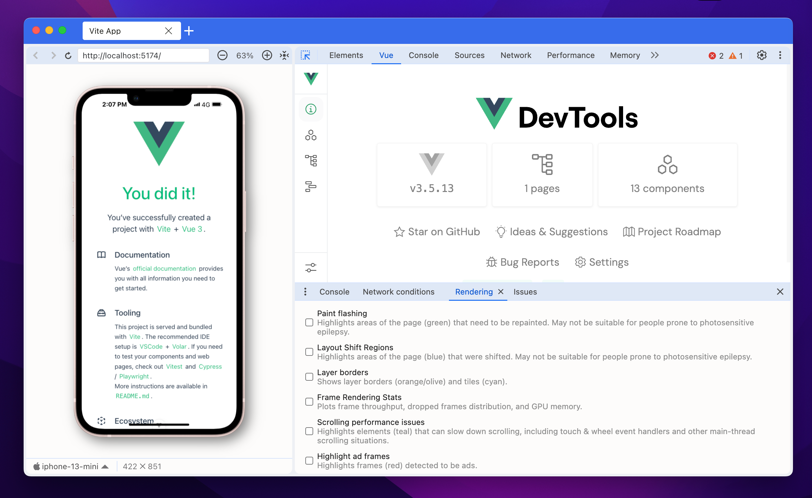

# h5-devtools

An Electron application with Vue



## Project Setup

### Pre-requisites

> Requires Node.js version 20+ and Vite version 4.0+

### Install

```bash
$ npm install
```

### Development

```bash
$ npm run dev
```

### Build

```bash
# For windows
$ npm run build:win

# For macOS
$ npm run build:mac

# For Linux
$ npm run build:linux
```
